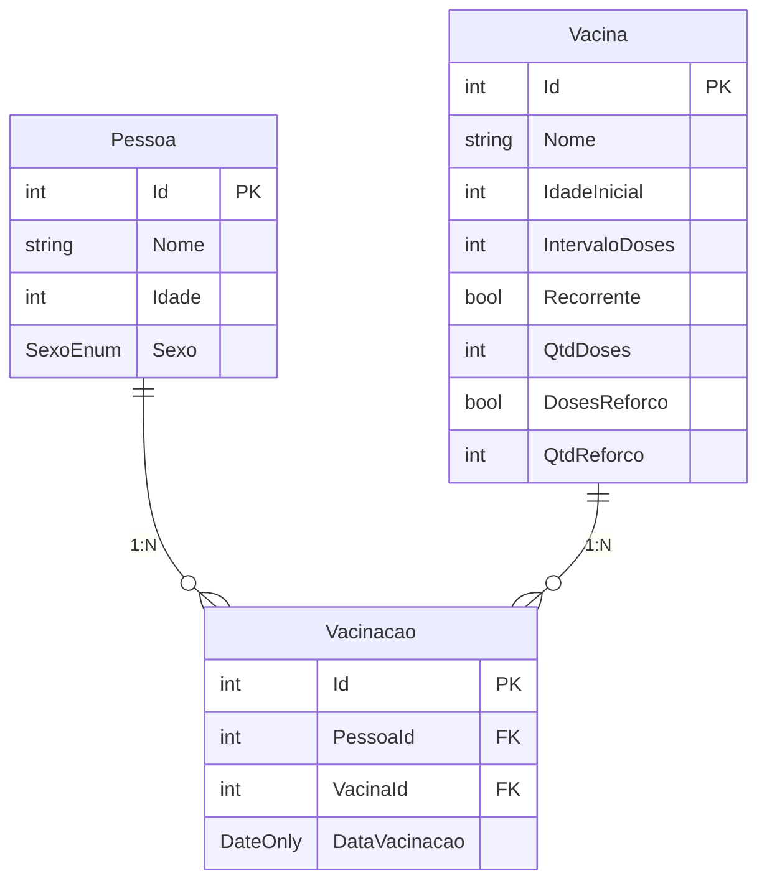

# Documentação do Sistema - Carteira de Vacinação

## Visão Geral

Este é um sistema completo para gerenciamento de vacinas e histórico de vacinação de pessoas. O
sistema é composto por uma **API REST** desenvolvida em **ASP.NET** e um **Frontend** desenvolvido em **React**
com **Vite** e **Tailwind CSS**.

🌐 **Aplicação em Produção:** [https://carteira-vacinacao.lucasalopes.com.br](https://carteira-vacinacao.lucasalopes.com.br)

---

## 📋 Índice

1. [Setup e Execução](#-setup-e-execução)
2. [Banco de Dados](#-banco-de-dados)
3. [API REST - Endpoints](#-api-rest---endpoints)
4. [Frontend](#-frontend)
5. [Decisões Arquiteturais](#-decisões-arquiteturais)

---

## 🛠 Stack

### Backend (API)

| Tecnologia   | Versão      | Objetivo                  |
|--------------|-------------|---------------------------|
| .NET         | 9.0         | Framework principal       |
| ASP.NET Core | 9.0         | Framework web             |
| PostgreSQL   | 15.7-alpine | Banco de dados relacional |

### Frontend (Web)

| Tecnologia   | Versão | Objetivo                 |
|--------------|--------|--------------------------|
| React        | 19.2.0 | Biblioteca UI            |
| Vite         | 7.2.4  | Build tool e dev server  |
| TypeScript   | 5.9.3  | Tipagem estática         |
| Tailwind CSS | 4.1.18 | Framework CSS utilitário |

### Infraestrutura

| Tecnologia     | Objetivo                   |
|----------------|----------------------------|
| Docker         | Containerização            |
| Docker Compose | Orquestração de containers |

---

### Estrutura de Diretórios

```
carteira-vacinacao/
├── api/                          
│   ├── Controllers/              
│   ├── Models/                   
│   ├── Dtos/                     
│   ├── Services/                 
│   ├── Repositories/             
│   ├── Mappers/                  
│   ├── Middleware/               
│   ├── Exceptions/               
│   ├── Data/                     
│   ├── Migrations/               
│   ├── Api.Tests/                
│   ├── Startup.cs                
│   ├── Program.cs                
│   ├── Dockerfile
│   └── .env                      
│
├── web/                          
│   ├── src/
│   │   ├── components/           
│   │   ├── services/             
│   │   ├── types/                
│   │   ├── contexts/             
│   │   ├── App.tsx               
│   │   └── main.tsx              
│   ├── nginx.conf                
│   ├── Dockerfile
│   └── package.json
│
└── compose.yaml                  
```

---

## 🚀 Setup e Execução

### Pré-requisitos

- **Docker** e **Docker Compose** instalados
- (Opcional para desenvolvimento) **.NET 9 SDK**, **Node.js 20+**

### Variáveis de Ambiente

Crie o arquivo `api/.env` com as seguintes variáveis:

```env
POSTGRES_HOST=db
POSTGRES_PORT=5432
POSTGRES_DB=carteiravacinacao
POSTGRES_USER=postgres
POSTGRES_PASSWORD=sua_senha_segura
ASPNETCORE_ENVIRONMENT=Development (opcional, habilita o swagger)
```

### Executando com Docker Compose

```bash
# Subir todos os serviços (em background)
docker compose up -d --build

# Ver logs
docker compose logs -f

# Parar os serviços
docker compose down
```

### Acessando os Serviços

| Serviço       | URL                           |
|---------------|-------------------------------|
| Frontend      | http://localhost:4200         |
| API           | http://localhost:8080         |
| Swagger (Dev) | http://localhost:8080/swagger |
| PostgreSQL    | localhost:5432                |

### Desenvolvimento Local

#### Backend

```bash
cd api
dotnet restore
dotnet run
```

#### Frontend

```bash
cd web
npm install
npm run dev
```

> ##### Obs: caso vá executar localmente, altere a variável POSTGRES_HOST em api/.env para 'localhost'

---

## 📊 Banco de Dados

### Diagrama ER



---

## 📡 API REST - Endpoints

### Base URL

```
http://localhost:8080
```

### Documentação Swagger/OpenAPI

Em ambiente de desenvolvimento (`ASPNETCORE_ENVIRONMENT=Development`), a documentação interativa da API está disponível em:

```
http://localhost:8080/swagger
```

O Swagger UI permite visualizar todos os endpoints, seus parâmetros e testar as requisições diretamente no navegador.

### Pessoa

| Método   | Endpoint       | Descrição               |
|----------|----------------|-------------------------|
| `GET`    | `/pessoa`      | Listar todas as pessoas |
| `GET`    | `/pessoa/{id}` | Buscar pessoa por ID    |
| `POST`   | `/pessoa`      | Criar nova pessoa       |
| `PUT`    | `/pessoa/{id}` | Atualizar pessoa        |
| `DELETE` | `/pessoa/{id}` | Remover pessoa          |
| `GET`    | `/pessoa/sexo` | Listar opções de sexo   |

#### Exemplos de Chamadas - Pessoa

**Criar Pessoa**

```bash
curl -X POST http://localhost:8080/pessoa \
  -H "Content-Type: application/json" \
  -d '{
    "nome": "João Silva",
    "idade": 30,
    "sexo": "Masculino"
  }'
```

**Resposta:**

```json
{
  "id": 1,
  "nome": "João Silva",
  "idade": 30,
  "sexo": "Masculino"
}
```

**Listar Pessoas**

```bash
curl http://localhost:8080/pessoa
```

**Resposta:**

```json
[
  {
    "id": 1,
    "nome": "João Silva",
    "idade": 30,
    "sexo": "Masculino"
  },
  {
    "id": 2,
    "nome": "Maria Santos",
    "idade": 25,
    "sexo": "Feminino"
  }
]
```

**Atualizar Pessoa**

```bash
curl -X PUT http://localhost:8080/pessoa/1 \
  -H "Content-Type: application/json" \
  -d '{
    "nome": "João Silva Junior",
    "idade": 31,
    "sexo": "Masculino"
  }'
```

**Deletar Pessoa**

```bash
curl -X DELETE http://localhost:8080/pessoa/1
```

> Retorno: `204 No Content`

---

### Vacina

| Método   | Endpoint       | Descrição               |
|----------|----------------|-------------------------|
| `GET`    | `/vacina`      | Listar todas as vacinas |
| `GET`    | `/vacina/{id}` | Buscar vacina por ID    |
| `POST`   | `/vacina`      | Criar nova vacina       |
| `PUT`    | `/vacina/{id}` | Atualizar vacina        |
| `DELETE` | `/vacina/{id}` | Remover vacina          |

#### Exemplos de Chamadas - Vacina

**Criar Vacina (Não Recorrente)**

```bash
curl -X POST http://localhost:8080/vacina \
  -H "Content-Type: application/json" \
  -d '{
    "nome": "BCG",
    "idadeInicial": 0,
    "intervaloDoses": 1,
    "recorrente": false,
    "qtdDoses": 1,
    "dosesReforco": false,
    "qtdReforco": null
  }'
```

**Criar Vacina (Com Reforço)**

```bash
curl -X POST http://localhost:8080/vacina \
  -H "Content-Type: application/json" \
  -d '{
    "nome": "Hepatite B",
    "idadeInicial": 0,
    "intervaloDoses": 1,
    "recorrente": false,
    "qtdDoses": 3,
    "dosesReforco": true,
    "qtdReforco": 1
  }'
```

**Criar Vacina (Recorrente)**

```bash
curl -X POST http://localhost:8080/vacina \
  -H "Content-Type: application/json" \
  -d '{
    "nome": "Influenza",
    "idadeInicial": 6,
    "intervaloDoses": 12,
    "recorrente": true,
    "qtdDoses": null,
    "dosesReforco": false,
    "qtdReforco": null
  }'
```

**Resposta:**

```json
{
  "id": 1,
  "nome": "BCG",
  "idadeInicial": 0,
  "intervaloDoses": 1,
  "recorrente": false,
  "qtdDoses": 1,
  "dosesReforco": false,
  "qtdReforco": null
}
```

---

### Vacinação

| Método   | Endpoint                           | Descrição                         |
|----------|------------------------------------|-----------------------------------|
| `GET`    | `/vacinacao`                       | Listar todas as vacinações        |
| `GET`    | `/vacinacao/{id}`                  | Buscar vacinação por ID           |
| `POST`   | `/vacinacao`                       | Registrar nova vacinação          |
| `PUT`    | `/vacinacao/{id}`                  | Atualizar vacinação               |
| `DELETE` | `/vacinacao/{id}`                  | Remover vacinação                 |
| `GET`    | `/vacinacao/pessoa/{id}`           | Histórico de vacinação por pessoa |
| `GET`    | `/vacinacao/pessoa/{id}/atrasadas` | Vacinas atrasadas da pessoa       |

#### Exemplos de Chamadas - Vacinação

**Registrar Vacinação**

```bash
curl -X POST http://localhost:8080/vacinacao \
  -H "Content-Type: application/json" \
  -d '{
    "pessoaId": 1,
    "vacinaId": 1,
    "dataVacinacao": "2024-01-15"
  }'
```

**Resposta:**

```json
{
  "id": 1,
  "pessoaId": 1,
  "vacinaId": 1,
  "dataVacinacao": "2024-01-15"
}
```

**Histórico de Vacinação da Pessoa**

```bash
curl http://localhost:8080/vacinacao/pessoa/1
```

**Resposta:**

```json
[
  {
    "vacinaId": 1,
    "historico": [
      {
        "vacinacaoId": 1,
        "dataVacinacao": "2024-01-15"
      },
      {
        "vacinacaoId": 3,
        "dataVacinacao": "2024-02-15"
      }
    ]
  },
  {
    "vacinaId": 2,
    "historico": [
      {
        "vacinacaoId": 2,
        "dataVacinacao": "2024-01-20"
      }
    ]
  }
]
```

**Vacinas Atrasadas da Pessoa**

```bash
curl http://localhost:8080/vacinacao/pessoa/1/atrasadas
```

**Resposta:**

```json
[
  {
    "id": 3,
    "nome": "Hepatite B",
    "idadeInicial": 0,
    "intervaloDoses": 1,
    "recorrente": false,
    "qtdDoses": 3,
    "dosesReforco": false,
    "qtdReforco": null
  }
]
```

---

### Códigos de Resposta HTTP

| Código                      | Descrição                                            |
|-----------------------------|------------------------------------------------------|
| `200 OK`                    | Requisição bem-sucedida                              |
| `204 No Content`            | Operação bem-sucedida sem corpo de resposta (DELETE) |
| `400 Bad Request`           | Dados inválidos ou malformados                       |
| `404 Not Found`             | Recurso não encontrado                               |
| `409 Conflict`              | Conflito de regras de negócio                        |
| `500 Internal Server Error` | Erro interno do servidor                             |

### Estrutura de Erros

```json
{
  "message": "Descrição do erro"
}
```

**Exemplos de erros:**

- `"Pessoa não encontrada com o id: 99"` (404)
- `"A vacina BCG só permite 1 doses."` (409)
- `"A próxima dose da vacina Hepatite B só pode ser aplicada a partir de 15/02/2024."` (409)

---

## 🏛 Decisões Arquiteturais

### 1. Padrão de Camadas (Layered Architecture)

A API segue uma arquitetura em camadas bem definida:

```
Controllers → Services → Repositories → Database
```

**Justificativa:**

- Separação de responsabilidades clara
- Facilita testes unitários (mocking de dependências)
- Permite substituição de camadas (ex: trocar ORM)

### 2. Injeção de Dependências

Todas as dependências são injetadas via DI Container do ASP.NET Core:

```csharp
// Repositories: Scoped (por requisição)
services.AddScoped<IPessoaRepository, PessoaRepository>();

// Mappers: Singleton (stateless)
services.AddSingleton<IBaseMapper<Pessoa, PessoaRequestDto, PessoaResponseDto>, PessoaMapper>();

// Services: Scoped (por requisição)
services.AddScoped<IPessoaService, PessoaService>();
```

**Justificativa:**

- Facilita testes unitários
- Desacoplamento entre componentes
- Configuração centralizada

### 3. DTO Pattern (Data Transfer Objects)

Separação entre entidades do domínio e objetos de transferência:

```
Entity (Pessoa) ←→ Mapper ←→ DTO (PessoaRequestDto/PessoaResponseDto)
```

**Justificativa:**

- Controle sobre o que é exposto na API
- Validação de entrada (Data Annotations nos DTOs)
- Flexibilidade para evoluir entidades sem quebrar a API
- Desacoplamento entre as camadas da aplicação

### 4. Global Exception Handler

Middleware centralizado para tratamento de exceções:

```csharp
switch (exception)
{
    case NotFoundException:
        statusCode = HttpStatusCode.NotFound;    // 404
        break;
    case ModelException:
        statusCode = HttpStatusCode.Conflict;    // 409
        break;
    default:
        statusCode = HttpStatusCode.InternalServerError; // 500
        break;
}
```

**Justificativa:**

- Respostas de erro consistentes
- Logs centralizados
- Evita vazamento de stack traces em produção

### 5. Validação de Regras de Negócio na Service Layer

Regras como limite de doses e intervalo entre doses são validadas no `VacinacaoService`:

```csharp
private void ValidarNumeroDoses(Vacinacao vacinacao) { ... }
private void ValidarPrazoProximaDose(Vacinacao vacinacao) { ... }
```

**Justificativa:**

- Garante integridade dos dados
- Regras centralizadas (não duplicadas no frontend)
- Mensagens de erro claras para o usuário

### 6. Migrations Automáticas

As migrations do EF Core são aplicadas automaticamente na inicialização:

```csharp
using (var scope = app.Services.CreateScope())
{
    var dbContext = scope.ServiceProvider.GetRequiredService<AppDbContext>();
    dbContext.Database.Migrate();
}
```

**Justificativa:**

- Deploy simplificado
- Banco sempre atualizado
- Ideal para containers efêmeros

### 7. Serialização de Enums como Strings

```csharp
services.AddControllers()
    .AddJsonOptions(options =>
    {
        options.JsonSerializerOptions.Converters.Add(new JsonStringEnumConverter());
    });
```

**Justificativa:**

- APIs mais legíveis (`"Masculino"` vs `0`)
- Facilita debug e logs
- Frontend não precisa mapear números

### 8. Uso de Interfaces (Programação Orientada a Contratos)

Todos os Services, Repositories e Mappers são definidos por interfaces:

```csharp
// Interfaces
public interface IBaseService<T> { ... }
public interface IPessoaService : IBaseService<Pessoa> { ... }
public interface IBaseRepository<T> { ... }
public interface IPessoaRepository : IBaseRepository<Pessoa> { ... }
public interface IBaseMapper<TEntity, TRequestDto, TResponseDto> { ... }
```

**Justificativa:**

- Permite criar mocks facilmente para testes unitários, isolando a camada sendo testada
- Controllers dependem apenas de abstrações, não de implementações concretas
- Facilita a troca de implementações sem alterar o código
- Interfaces servem como contratos claros que definem as operações disponíveis
- Princípio da Inversão de Dependência (SOLID): Módulos de alto nível não dependem de módulos de baixo nível, ambos dependem de abstrações

### 9. Camada de Services no Frontend

O frontend implementa uma **camada de abstração para comunicação com a API**, seguindo o padrão de separação de responsabilidades. Cada entidade do domínio (Pessoa, Vacina, Vacinação) possui seu próprio arquivo de service dedicado.

**Estrutura:**
- `apiClient.ts` — Configuração base da URL da API e funções utilitárias para tratamento de erros
- `pessoaService.ts` — Operações CRUD para pessoas e consulta de opções de sexo
- `vacinaService.ts` — Operações CRUD para vacinas
- `vacinacaoService.ts` — Registro de vacinações, histórico por pessoa e consulta de vacinas atrasadas

**Justificativa:**

- Funções podem ser chamadas por múltiplos componentes sem duplicação de código
- Alterações na API (endpoints, headers) são feitas em um único local

### 10. Tipagem com TypeScript

O frontend utiliza **TypeScript com tipagem estrita** para garantir segurança de tipos em tempo de compilação. Os tipos são organizados em arquivos dedicados no diretório `types/`, espelhando as entidades do backend.

**Justificativa:**

- Tipos do frontend refletem os DTOs da API, evitando erros de integração

### 11. Nginx como Reverse Proxy

O frontend em produção usa Nginx para:

- Servir arquivos estáticos (React build)
- Proxy reverso para a API (`/api/* → http://api:8080/`)
- Cache de assets estáticos

**Justificativa:**

- Performance superior para arquivos estáticos
- SPA routing (`try_files $uri $uri/ /index.html`)
- Simplifica CORS (mesma origem)


---

## 📝 Notas Adicionais

### Volumes Docker

O volume `db-data` persiste os dados do PostgreSQL entre reinicializações:

```yaml
volumes:
  db-data:
```

### Network Docker

Todos os serviços compartilham a rede `app-network`, permitindo comunicação por nome de container:

- Frontend chama `http://api:8080`
- API chama `db:5432`
